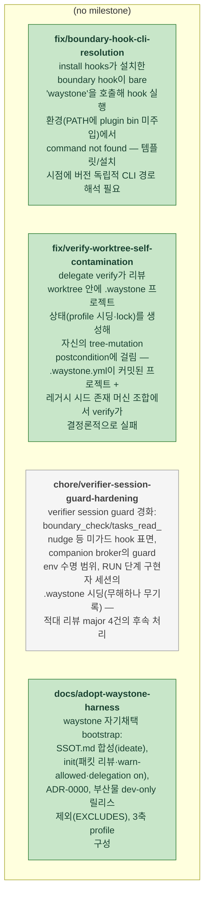

<!-- GENERATED by waystone (roadmap.py) — DO NOT EDIT.
     Source of truth: tasks.yaml. Regenerated automatically on tasks.yaml edits. -->
# Roadmap — waystone

**Progress:** 3/4 done · 0 active · 0 blocked · generated 2026-07-16 08:12 UTC @ `c8ec816`

## Tasks

| ID | Title | Status | Round | Deps | Anchor |
|---|---|---|---|---|---|
| `chore/verifier-session-guard-hardening` | verifier session guard 경화: boundary_check/tasks_read_nudge 등 미가드 hook 표면, companion broker의 guard env 수명 범위, RUN 단계 구현자 세션의 .waystone 시딩(무해하나 무기록) — 적대 리뷰 major 4건의 후속 처리 | ⬜ pending | — | — | — |
| `docs/adopt-waystone-harness` | waystone 자기채택 bootstrap: SSOT.md 합성(ideate), init(패킷 리뷰·warn-allowed·delegation on), ADR-0000, 부산물 dev-only 릴리스 제외(EXCLUDES), 3축 profile 구성 | ✅ done | 2026-07-16-adopt-dogfooding | — | — |
| `fix/boundary-hook-cli-resolution` | install hooks가 설치한 boundary hook이 bare 'waystone'을 호출해 hook 실행 환경(PATH에 plugin bin 미주입)에서 command not found — 템플릿/설치 시점에 버전 독립적 CLI 경로 해석 필요 | ✅ done | 2026-07-16-adopt-dogfooding | — | — |
| `fix/verify-worktree-self-contamination` | delegate verify가 리뷰 worktree 안에 .waystone 프로젝트 상태(profile 시딩·lock)를 생성해 자신의 tree-mutation postcondition에 걸림 — .waystone.yml이 커밋된 프로젝트 + 레거시 시드 존재 머신 조합에서 verify가 결정론적으로 실패 | ✅ done | 2026-07-16-adopt-dogfooding | — | — |
